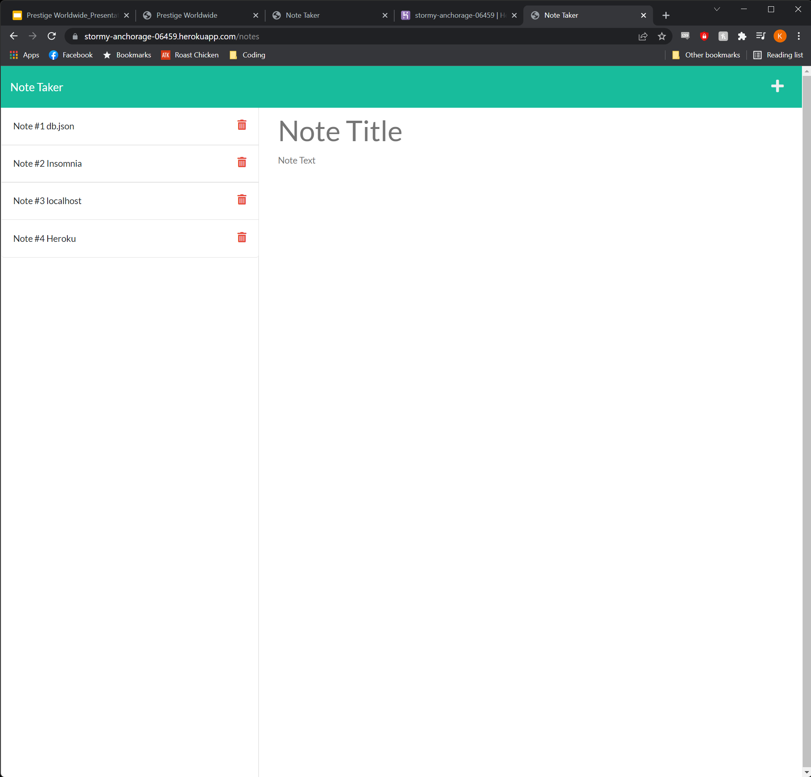

# Note Taker Web App

## Description

- This project allows users to write and store notes to a database. It is the first full stack project and leverages the npm Express module to host a server to answer the API calls needed to function properly.

## Table of Contents

- [Screenshot](#Screenshot)
- [Installation](#Installation)
- [Usage](#Usage)
- [Example](#example)
- [Contribution Guidelines](#contribution-guidelines)
- [Questions](#questions)

# Screenshot

# Installation

- In order to run this application you first need to:

  - Download and install Node.js
  - Clone this repository to your local machine
  - Install the necessary Node modules (Express, FS) within that repository

- Alternatively you can simply visit the deployed application on Heroku [here](https://stormy-anchorage-06459.herokuapp.com/)

# Usage

Anyone can use this application to write notes for themselves or to share with others.

# Contribution Guidelines

- Please use the contact information in the Questions section to discuss how you can contribute to this project.

# Questions

- If you'd like more information or wish to connect with me regarding this project please use the contact information below:
  - [GitHub](https://github.com/KevinJWilkerson)
  - Email: Kevin.J.Wilkerson@gmail.com
